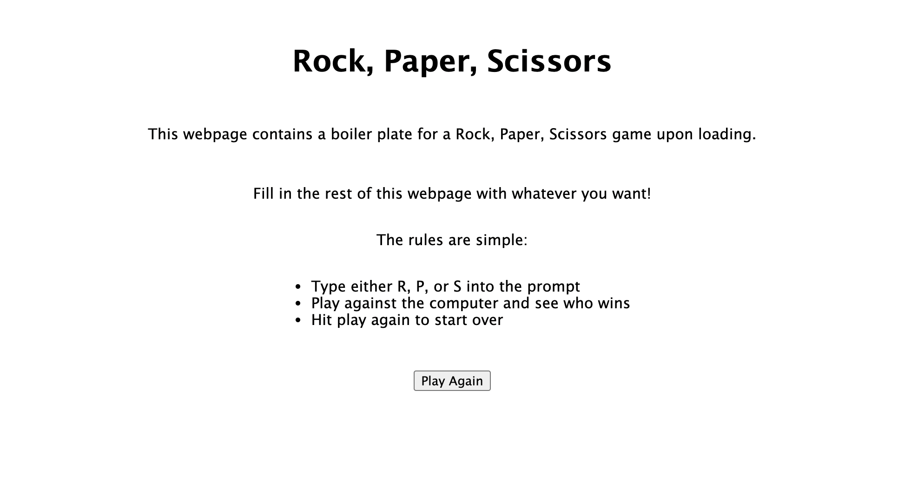

# JavaScript Rock, Paper, Scissors

## Description

- RPS mini project for JavaScript practice
- This project was aimed at using conditional statements to build a rock, paper, scissors game
- Also serves as a boiler plate for a basic webpage that utilizes the game upon loading
- Gained a better understanding on JavaScript functions, conditional statements, and scope
-
## Table of Contents

- [Installation](#installation)
- [Usage](#usage)
- [Technologies](#technologies)
- [Screenshots](#screenshots)
- [Credits](#credits)
- [License](#license)

## Installation
N/A

## Technologies
- HTML 
- CSS
-J avaScript

## Usage
Webpage available here:
https://jminaga.github.io/js_rps/index.html

## Screenshots

## Credits
Denver University Full-Stack Web Development Bootcamp

## license
N/A